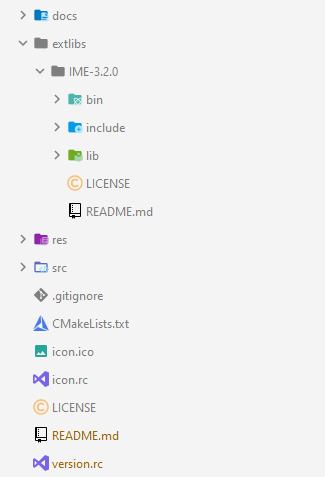

# Galaxian Clone

This project is a [1979 Galaxian arcade game](https://en.wikipedia.org/wiki/Galaxian) clone using my 2D game engine, [Infinite Motion Engine](https://github.com/KwenaMashamaite/IME). 
The game and the engine are both written in C++17.

## How to play

1. [Download](https://github.com/KwenaMashamaite/Galaxian/releases/tag/v0.5.0) game
2. Extract the zip archive
3. Run _Galaxian.exe_
4. Enjoy :video_game:

## Build

###### *Read this section if you want to build the game yourself, otherwise you can just [download](https://github.com/KwenaMashamaite/Galaxian/releases/tag/v0.5.0) it.*

This project is a CMake project, therefore you must download and install [CMake](https://cmake.org/) 3.21 or above. 
You also need to download [Infinite Motion Engine v3.1.0](https://github.com/KwenaMashamaite/IME/releases/tag/v3.1.0). 
Then:

1. Clone the repository
2. After cloning, create a folder in the root of the directory created in step 1 and name it `extlibs`
3. Extract **IME** to the `extlibs` folder created in step 2. The project directory should end up looking like:


   
At this point your ready to build the project. You may use an IDE that supports building with *CMake* or
the *Command Line Interface (CLI)* using the following commands:

```shell
mkdir build
cd build
cmake ..
cmake --build .
```

The executable can be found in the `bin` directory

## Platform

This game only runs on the Windows platform. It was tested on Windows 10. However,
it should run on Windows 7 and 8.1 without any issues.

## License

This project is released under the [MIT](LICENSE) license
